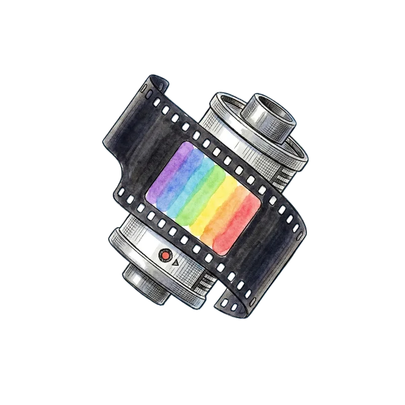
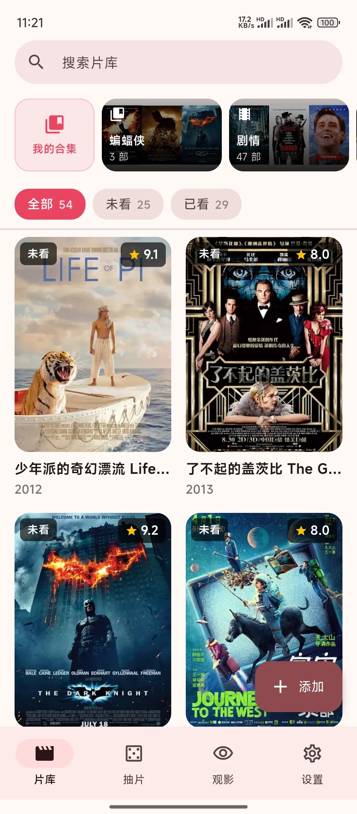
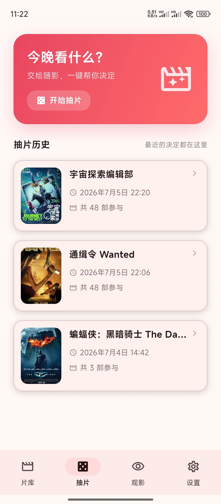
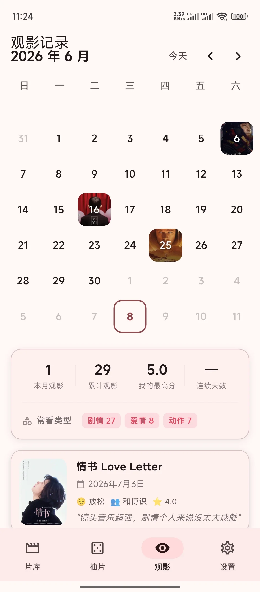
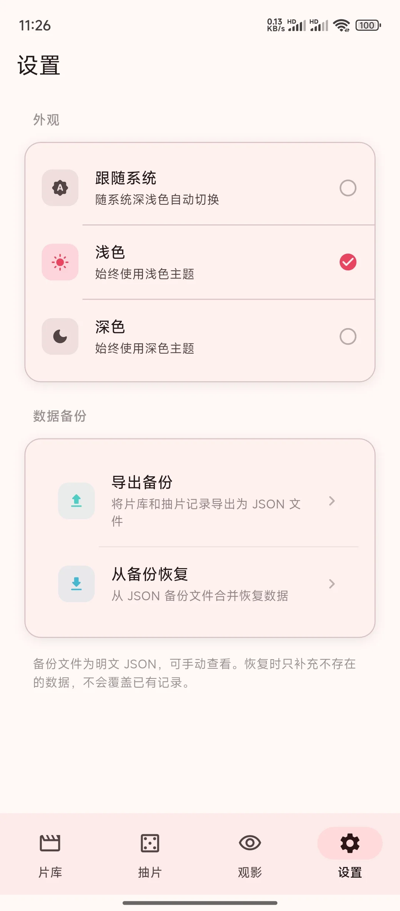
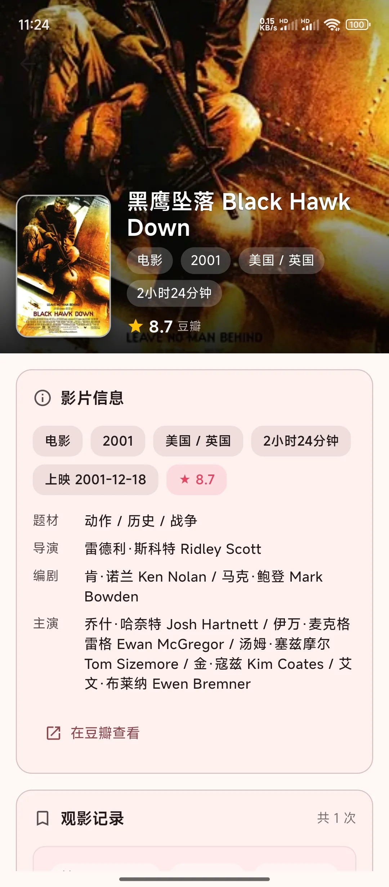
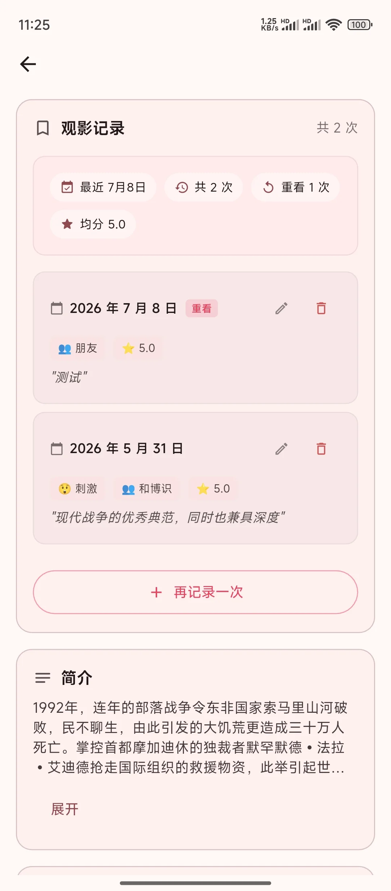
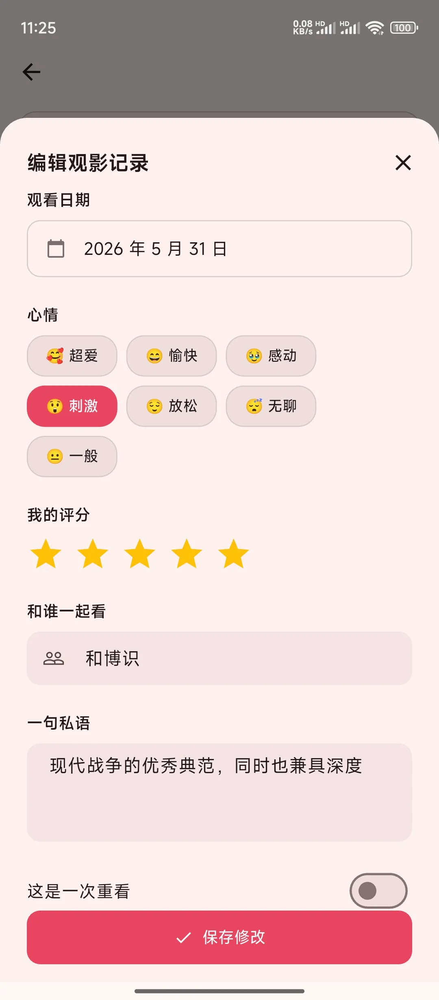
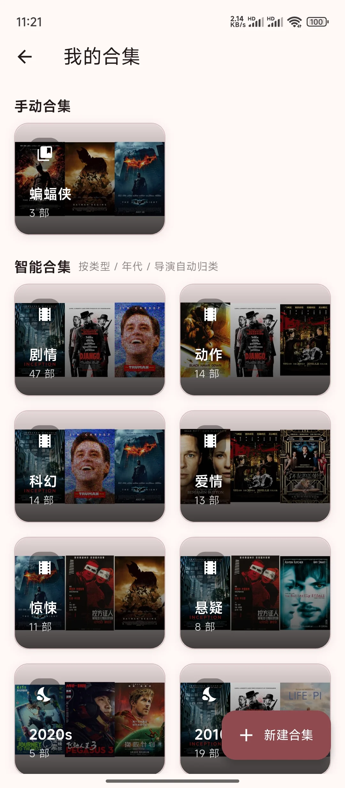
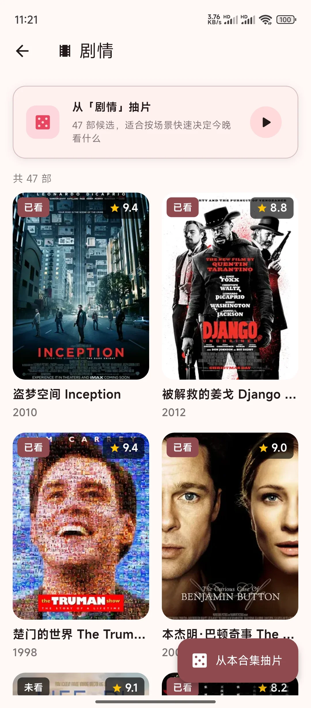

  
  <h1 align=center>片刻</h1>

  给每一次观影，留下一点当时的自己。

  

    <strong>多次记录</strong> ·
    <strong>多维感受</strong> ·
    <strong>私人片库</strong> ·
    <strong>随机抽片</strong>
  

---

## 片刻是什么

片刻不是电影社区，也不是豆瓣的替代品。

它更像一本只属于你的观影手帐：同一部电影可以记录很多次，每一次都可以留下日期、地点、同伴、心情、评分和短评；也可以什么都不细填，只用两句话写下“那天看完以后，心里发生了什么”。

有些电影适合认真标注，有些电影只值得随手记一笔。片刻想保留下来的，正是这些很私人的观影瞬间。

## 界面预览

### 主页一览

<table>
  <tr>
    <td align="center"></td>
    <td align="center"></td>
    <td align="center"></td>
    <td align="center"></td>
  </tr>
  <tr>
    <td align="center">片库</td>
    <td align="center">抽片</td>
    <td align="center">观影记录</td>
    <td align="center">设置</td>
  </tr>
</table>

### 影片详情与观影记录

影片详情页不只展示电影信息，更重要的是承载每一次观看后的记录。同一部电影可以反复留下不同时间、不同心情、不同同伴下的感受。

<table>
  <tr>
    <td align="center"></td>
    <td align="center"></td>
    <td align="center"></td>
  </tr>
  <tr>
    <td align="center">影片详情</td>
    <td align="center">观看轨迹</td>
    <td align="center">编辑记录</td>
  </tr>
</table>

### 添加影片

想看的电影可以快速加入片库，之后再慢慢补充观看记录、整理合集，或者等某天抽片抽到它。

支持搜索添加，以及豆瓣影片链接添加和豆瓣片单链接添加。

<table>
  <tr>
    <td align="center"></td>
  </tr>
  <tr>
    <td align="center">搜索添加</td>
  </tr>
</table>

### 合集整理

合集适合收纳主题、系列、导演、节日或某种心情。它不是公开片单，而是你给自己的电影分类方式。

<table>
  <tr>
    <td align="center"></td>
    <td align="center"></td>
  </tr>
  <tr>
    <td align="center">我的合集</td>
    <td align="center">合集详情</td>
  </tr>
</table>

### 抽片决定

当片库越来越长，片刻可以从你的收藏里抽出一个今晚的答案。不是替你评分，只是帮你把犹豫变成开始。

<table>
  <tr>
    <td align="center"></td>
    <td align="center"></td>
  </tr>
  <tr>
    <td align="center">抽片首页</td>
    <td align="center">抽片结果</td>
  </tr>
</table>

## 独特之处

| 多次观看 | 多维记录 | 轻量短记 |
| --- | --- | --- |
| 同一部电影可以反复记录，每一次观看都是独立的记忆。 | 日期、评分、心情、同伴、地点、短评一起构成当时的现场感。 | 不想写长评时，只用一两句话记下当时感觉也足够。 |

| 私人片库 | 合集整理 | 抽片决定 |
| --- | --- | --- |
| 收藏真正属于自己的想看、看过和重看清单。 | 按主题、系列、心情或任意灵感整理电影。 | 不知道今晚看什么时，让片刻从你的片库里给出答案。 |

## 使用场景

- 第二次看同一部电影，想知道自己和上一次有什么不同。
- 看完电影没力气写长评，但想留下两句真实的感受。
- 和朋友、恋人、家人一起看过某部片，想把那次场景也记下来。
- 片单越攒越长，想按心情、主题、系列慢慢整理。
- 选择困难时，希望从自己的片库里抽出今晚的答案。

## 数据与隐私

片刻默认把影片、观影记录、合集、标签和抽片历史保存在本机。无需登录账号，也不会主动上传你的私人片库。

备份文件会以明文形式导出，适合自行保存、迁移或检查内容。请把备份放在你信任的位置。

## License

Apache License 2.0

Copyright 2026 ShareWinter
